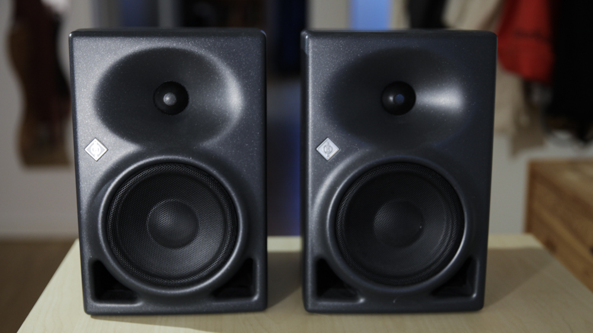
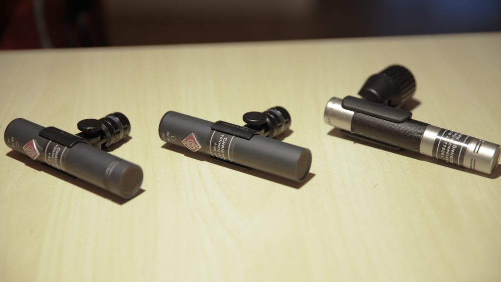
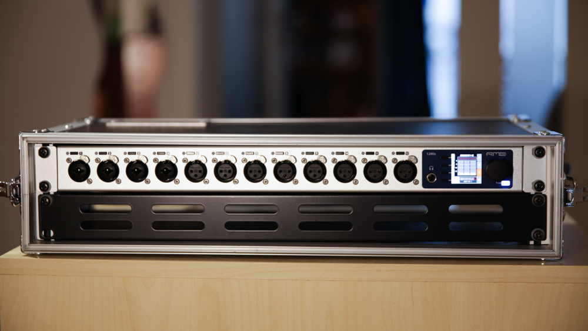
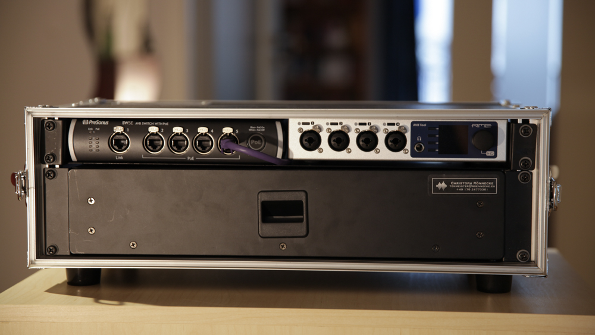
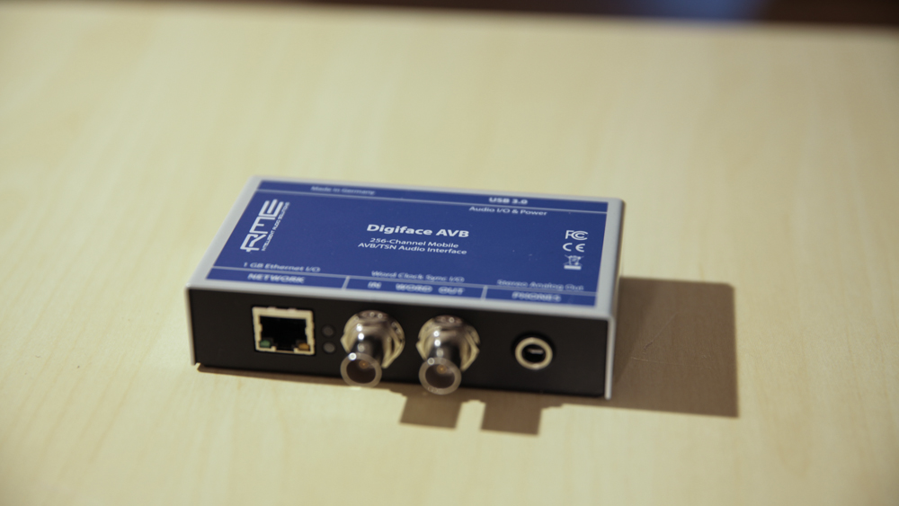
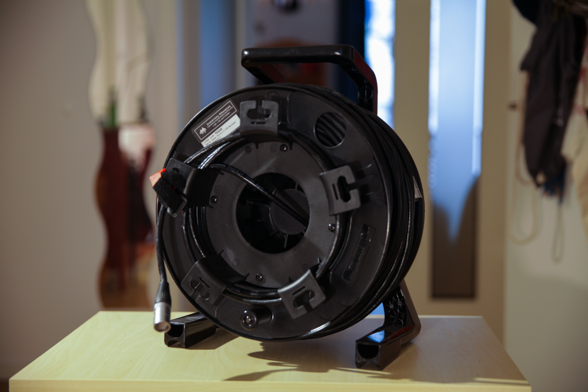

# Vermietung von Audio Equipment 

- [Lautsprecher](#lautsprecher)
- [Mikrofone](#mikrofone)
- [Ständer & Stative](#stative)
- [Wandlertechnik](#wandlertechnik)
- [Kabel](#kabel)
- [Zubehör](#sonstiges)

--------------------

<!-- BEGIN GEAR LIST -->

## Lautsprecher

**[`^        back to top        ^`](#)**

### Neumann KH 120 A (Paar) inkl. Transporttasche und Netzkabeln

  

- kompakter 2-Wege Studio-Nahfeldmonitor
- im Paar 12kg
- [Details auf der Herstellerseite](https://de-de.neumann.com/kh-120-a-g)

**12€ / Tag**

### Genelec 8020 DPM (Paar) inkl. Transporttasche und Netzkabeln

- aktiver 2-Wege Monitor für den mobilen Einsatz z.B. als Talkback
- im Paar 6kg
- [Details auf der Herstellerseite](https://www.genelec.com/8020d)

**7€ / Tag**

## Mikrofone

### Neumann KM 183 
- 4 Stk. vorhanden
- Kugel
- [Details auf der Herstellerseite](https://de-de.neumann.com/km-183-series-180)

**14€ / Tag**

### Neumann KM 184
- 4 Stk. vorhanden
- Niere
- [Details auf der Herstellerseite](https://de-de.neumann.com/km-184)

**11€ / Tag**

### Neumann TLM 103
- 1 Stk. vorhanden
- Niere
- [Details auf der Herstellerseite](https://de-de.neumann.com/tlm-103)

**9€ / Tag**

### RØDE NT-5
- 2 Stk. vorhanden
- Niere (opt. Wechselkapsel auf Kugel)
- [Details auf der Herstellerseite](https://de.rode.com/microphones/nt5)

**3€ / Tag**

**[`^        back to top        ^`](#)**

## Stative

### Manfrotto 1051 BAC Alu Stativ schwarz
- 3 Stk. vorhanden

**1€ / Tag**

### Manfrotto 1004BAC Aluminium Stativ 124-366cm
- 1 Stk. vorhanden

**1€ / Tag**

**[`^        back to top        ^`](#)**

## Wandlertechnik

### RME 12mic

- [Details auf der Herstellerseite](https://www.rme-audio.de/de_12mic.html)

**25€ / Tag**

### RME AVB Tool

- [Details auf der Herstellerseite](https://www.rme-audio.de/de_avb-tool.html)

**16€ / Tag**

### RME Digiface AVB

- [Details auf der Herstellerseite](https://www.rme-audio.de/de_digiface-avb.html)

### Presonus SW5E AVB Switch

- [Details auf der Herstellerseite](https://www.presonus.com/produkte/de/SW5E)

**4€ / Tag**

### RME ARC USB

- [Details auf der Herstellerseite](https://www.rme-audio.de/de_arc-usb.html)

**1€ / Tag**

### Recording Setup (12mic + AVB Tool + Digiface AVB + ARC USB + AVB Switch)

**50€/Tag**

**[`^        back to top        ^`](#)**

### RME Babyface v1

- [Details auf der Herstellerseite](https://archiv.rme-audio.de/products/babyface.php)

**4€ / Tag**

## Kabel

### Kabeltrommel ProSnake CAT6E 70m 

**2€/Tag**

**[`^        back to top        ^`](#)**

## Sonstiges

### K&M Stereoschiene 85cm

### K&M Stereoschiene 30cm

### RockNRoller RTR8

**[`^        back to top        ^`](#)**