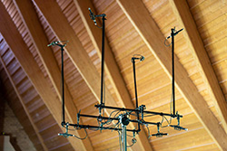

# Vermietung von Audio Equipment 

- [Lautsprecher](#lautsprecher)
- [Mikrofone](#mikrofone)
- [Ständer & Stative](#stative)
- [Wandlertechnik](#stative)
- [Kabel](#kabel)
- [Zubehör](#sonstiges)

--------------------

<!-- BEGIN GEAR LIST -->

## Lautsprecher

**[`^        back to top        ^`](#)**

### Neumann KH 120 A (Paar) inkl. Transporttasche und Netzkabeln

<!--  -->

- kompakter 2-Wege Studio-Nahfeldmonitor
- im Paar 12kg
- [Details auf der Herstellerseite](https://de-de.neumann.com/kh-120-a-g)

**12€ / Tag**

### Genelec 8020 DPM (Paar) inkl. Transporttasche und Netzkabeln

- aktiver 2-Wege Monitor für den mobilen Einsatz z.B. als Talkback
- im Paar 6kg
- [Details auf der Herstellerseite](https://www.genelec.com/8020d)

**7€ / Tag**

## Mikrofone

### Neumann KM 183 
- 4 Stk. vorhanden
- Kugel
- [Details auf der Herstellerseite](https://de-de.neumann.com/km-183-series-180)

**14€ / Tag**

### Neumann KM 184
- 4 Stk. vorhanden
- Niere
- [Details auf der Herstellerseite](https://de-de.neumann.com/km-184)

**11€ / Tag**

### Neumann TLM 103
- 1 Stk. vorhanden
- Niere
- [Details auf der Herstellerseite](https://de-de.neumann.com/tlm-103)

**9€ / Tag**

### RØDE NT-5
- 2 Stk. vorhanden
- Niere (opt. Wechselkapsel auf Kugel)
- [Details auf der Herstellerseite](https://de.rode.com/microphones/nt5)

**3€ / Tag**

**[`^        back to top        ^`](#)**

## Stative

**[`^        back to top        ^`](#)**

## Wandlertechnik

**[`^        back to top        ^`](#)**

## Kabel

**[`^        back to top        ^`](#)**

## Sonstiges

**[`^        back to top        ^`](#)**