# Vermietung Pro Audio Equipment

- [Lautsprecher](#lautsprecher)
- [Mikrofone](#mikrofone)
- [Ständer & Stative](#stative)
- [Wandlertechnik](#wandlertechnik)
- [Kabel](#kabel)
- [Zubehör](#sonstiges)

--------------------

<!-- BEGIN GEAR LIST -->

## Lautsprecher

**[`^        back to top        ^`](#)**

### Neumann KH 120 A (Paar) inkl. Transporttasche und Netzkabeln

 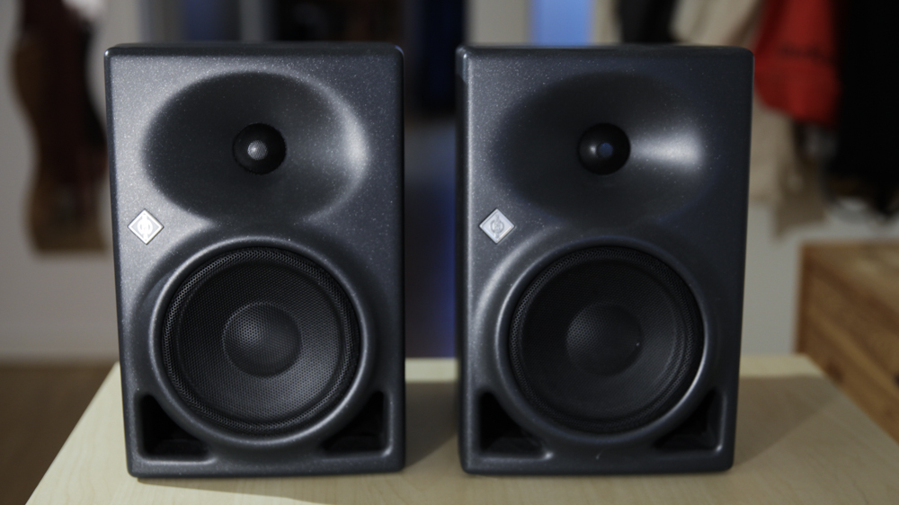 

- kompakter 2-Wege Studio-Nahfeldmonitor
- im Paar 12kg
- [Details auf der Herstellerseite](https://de-de.neumann.com/kh-120-a-g)

### Genelec 8020 DPM (Paar) inkl. Transporttasche und Netzkabeln

- aktiver 2-Wege Monitor für den mobilen Einsatz z.B. als Talkback / Monitor
- [Details auf der Herstellerseite](https://www.genelec.com/8020d)

## Mikrofone

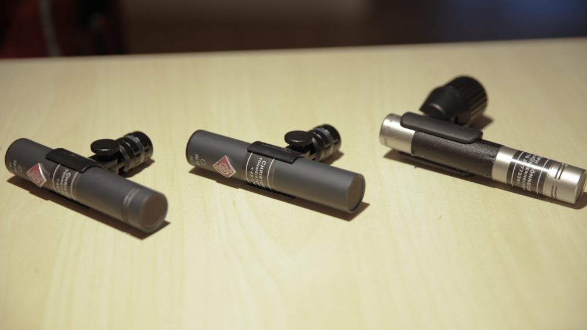

### Neumann KM 183 
- 4 Stk
- Kugel
- [Details auf der Herstellerseite](https://de-de.neumann.com/km-183-series-180)
  

### Neumann KM 184
- 6 Stk 
- Niere
- [Details auf der Herstellerseite](https://de-de.neumann.com/km-184)

### Neumann TLM 103
- 1 Stk
- Niere
- [Details auf der Herstellerseite](https://de-de.neumann.com/tlm-103)

### Austrian Audio OC818 
- 2 Stk
- umschaltbare Richtcharakteristik: Kugel, Niere, Superniere, Acht, mit Adapter kann man beide Kapseln vorn und hinten abgreifen
- [Details auf der Herstellerseite](https://www.thomann.de/de/austrian_audio_oc818_studio_set.htm)
  

### RØDE NT-5
- 2 Stk
- Niere (opt. Wechselkapsel auf Kugel)
- [Details auf der Herstellerseite](https://de.rode.com/microphones/nt5)

**[`^        back to top        ^`](#)**

## Stative

### Manfrotto 1051 BAC Alu Stativ schwarz
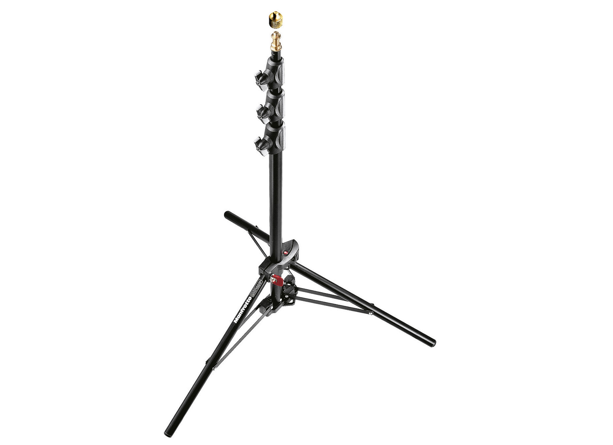
- 3 Stk. vorhanden
- Gewicht pro Stk: 1kg
- min. Höhe 75cm
- max. Höhe 211cm
- ohne Galgen

### Manfrotto 1004BAC Aluminium Stativ 124-366cm
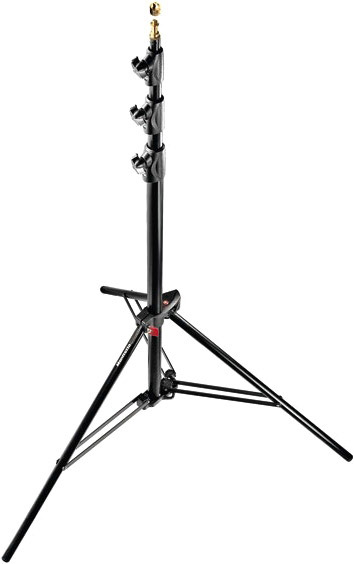
- 1 Stk. vorhanden
- min. Höhe 124cm
- max. Höhe 366cm
- Gewicht: 2,4kg
- ohne Galgen

### K&M 210er
- 3 Stk. vorhanden (davon 1x K&M 210/2; 2x K&M 210/8)
- 90cm bis 160cm höhenverstellbar
- mit Galgen

### Noname 210er
- 3 Stk. vorhanden
- mit Galgen

### K&M Stereoschiene 85cm
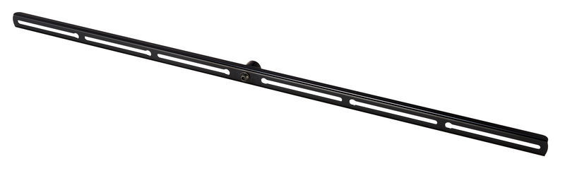
- 1 Stk. vorhanden

### K&M 236 Stereoschiene 30cm

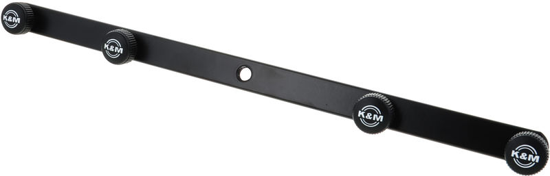
- 1 Stk. vorhanden

### K&M 238 Mikrofon-Halteschiene
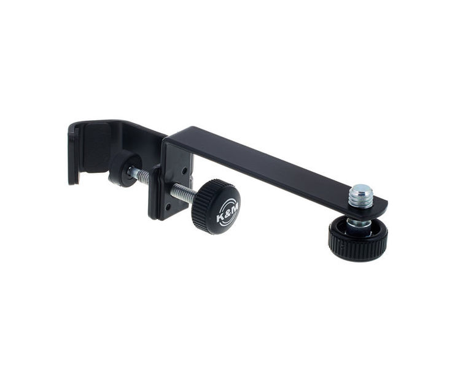
- 2 Stk. vorhanden

### Manfrotto Magic Arm 244N und Klemme, flexible Befestigung
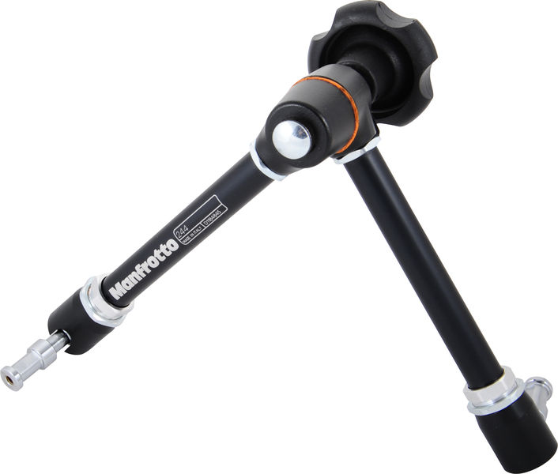
- 1 Stk. vorhanden

### Manfrotto 085 BSL Light Boom | Galgen, Gewicht und Gewinde
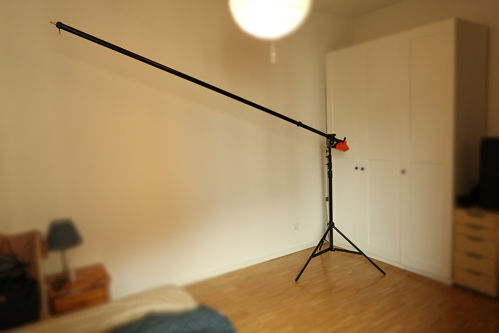
- belastungsfähiger Galgen
- bestehend aus 3 festen Stangen, die zusammengeschraubt werden. Dabei kann auch eine weggelassen werden
- Auszug max 280cm
- Auszug min: 100cm
- 7kg Gegengewicht
- inkl. Tragetasche

**[`^        back to top        ^`](#)**

## Wandlertechnik

### RME 12mic

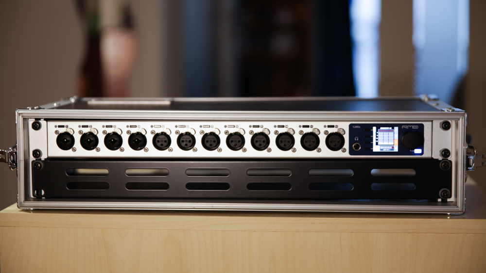

- 12 analoge Inputs (4x XLR-TRS combo, 8x XLR)
- 1 GigE AVB, 1 x Madi IO coaxial oder LWL
- 3x Adat Out, Symmetrische Klinke für Kopfhörer oder Talkback
- fernsteuerbar über Netzwerk
- RME MADI SFP Module Multi Mode (1 mal vorhanden)
- [Details auf der Herstellerseite](https://www.rme-audio.de/de_12mic.html)

### RME AVB Tool - Router, Mikrofonvorverstärker, MADI-AVB-Wandler und mehr

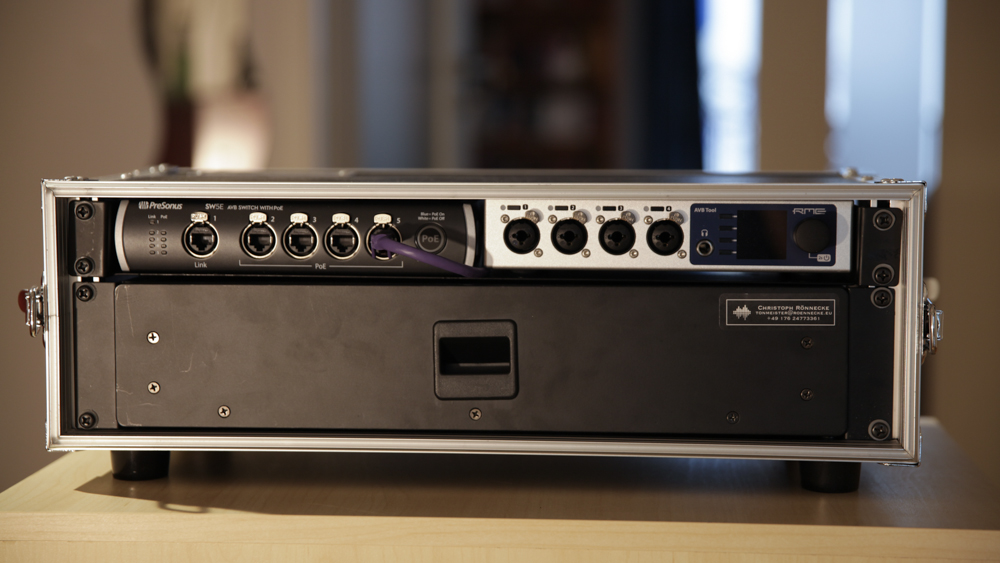
- 4 analoge Inputs (4x XLR-TRS combo)
- 1 Phone Out
- fernsteuerbar über Netzwerk
- TalkbackMic t.bone GM 5212 zum direkt anstecken
- [Details auf der Herstellerseite](https://www.rme-audio.de/de_avb-tool.html)

### RME Digiface AVB - USB-Audio-Interface AVB

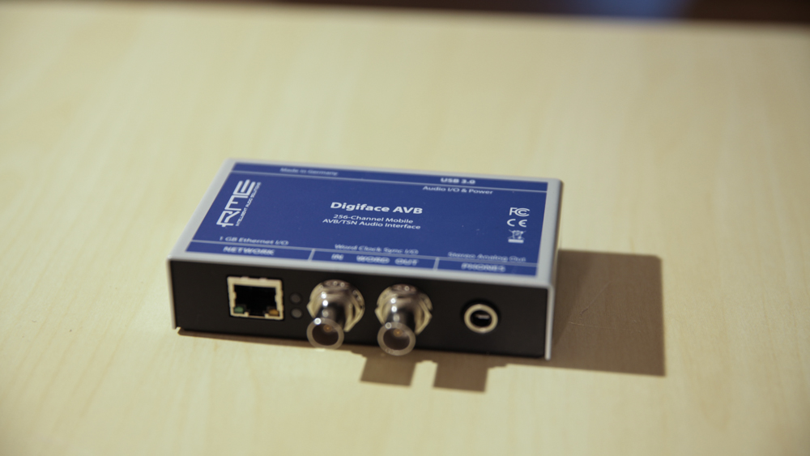

- [Details auf der Herstellerseite](https://www.rme-audio.de/de_digiface-avb.html)

### Presonus SW5E AVB Switch

- [Details auf der Herstellerseite](https://www.presonus.com/produkte/de/SW5E)

### RME ARC USB

- [Details auf der Herstellerseite](https://www.rme-audio.de/de_arc-usb.html)

### Recording Bundle (12mic + AVB Tool + Digiface AVB + ARC USB + AVB Switch)

**[`^        back to top        ^`](#)**

### RME Babyface v1 - USB Audio-Interface
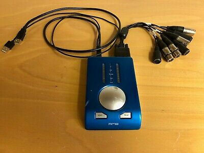
- 10 Eingangs- / 12 Ausgangskanäle
- 2 x Analog Input
- 4 x Analog Output
- 1 x ADAT I/O oder 1 x SPDIF I/O optisch
- [Details auf der Herstellerseite](https://archiv.rme-audio.de/products/babyface.php)

## Kabel

### Kabeltrommel ProSnake CAT6E 70m 

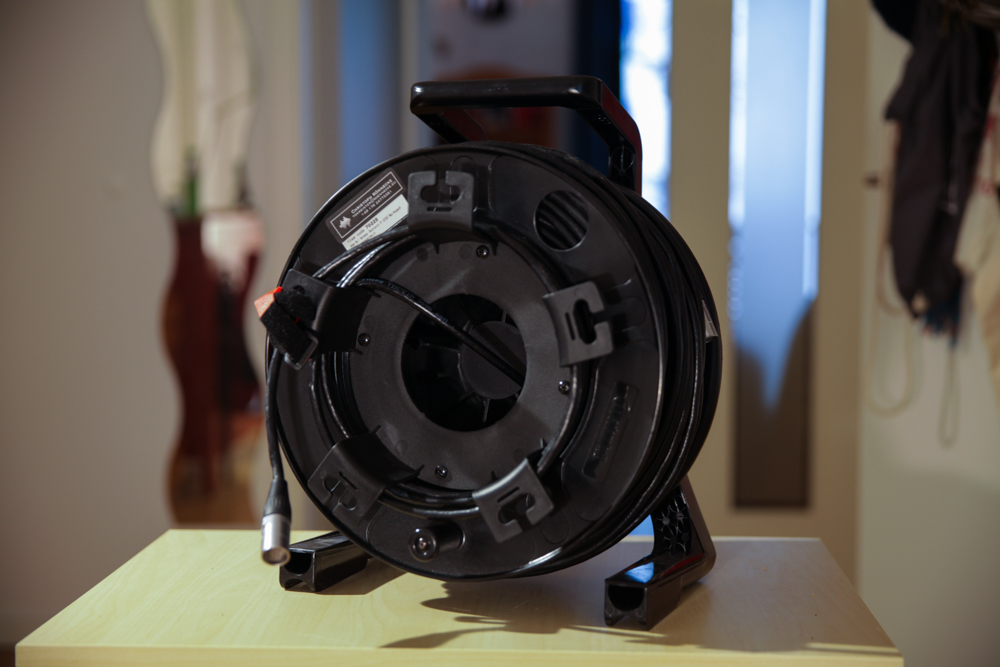

**[`^        back to top        ^`](#)**

## Sonstiges

### RockNRoller R8RT + Shelf als Tischeinsatz

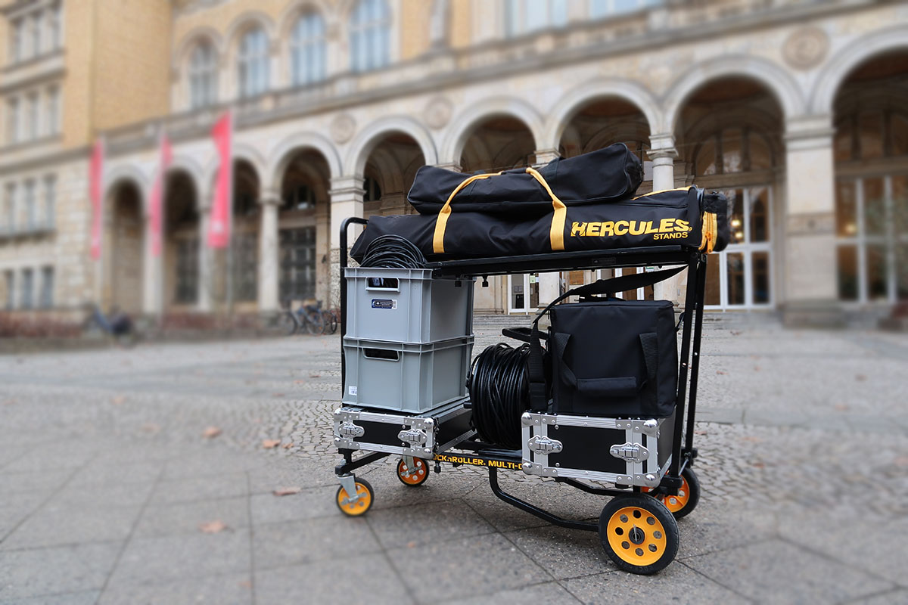
- Länge verstellbar von 86 - 132 cm (Auf Bild etwa 1/3 ausgezogen)
- Breite 35cm (inkl. Räder 48cm)
- Gewicht: 12,5kg, Belastbar mit 227kg
- [Details auf der Herstellerseite](https://rocknrollercart.com/collections/multi-carts/products/r-8-multi-cart)

**[`^        back to top        ^`](#)**
